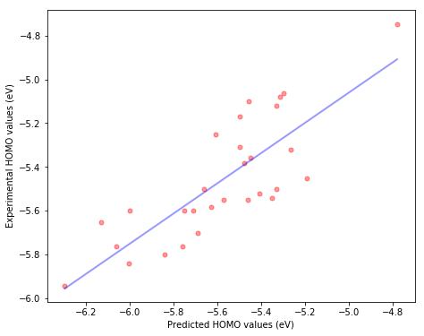

## Benchmarking DFT functionals

Goal: Report accuracy and performance of different functionals for Density Functional Theory calculation on molecular orbital energies: HOMO (Highest Occupied Molecular Orbitals), LUMO (Lowest Unoccupied Molecular Orbitals) and Bandgap.

### phase 1 : 

Title: Accurate predictions on the performance of organic photovoltaic materials: Benchmarking studies from DFT and TD-DFT

**Results:**

- Predictions from different functionals on 29 molecules ;
- Linear regression formula for corrections on calculated values (scaling factors) in order to match experimental values;
- HSE06 functional was selected due to the accuracy on both HOMO and Bandgap predictions;

**Scripts:**

**data extraction:**

- <u>*p1\_extract\_homolumo\_singlefile.py*</u>: Extracting HOMO/LUMO calculation results from Gaussian09 output file;
- <u>*p1\_extract\_homolumo\_folder\_difflevels.py*</u>: Extracting HOMO/LUMO calculation results from the folder containing many Gaussian09 files;
- <u>*p1\_extract\_tdsinglet\_gap\_singlefile.py*</u>:  Extracting Bandgap calculation results from Gaussian09 output file;
- <u>*p1\_extract\_tdsinglet\_gap\_folder\_difflevels.py*</u>: Extracting Bandgap calculation results from the folder containing many Gaussian09 files;

**data reading from files**

- <u>*read_a_cell_in_excel2013.py*</u>; read_data_from_excel2013.py: wrapper for "openpyxl" to read excel file;

**linear regress calculation from different python library**
Also discussed in my blog essay: https://shuod.github.io/post/linear-regression-with-python-lib/

- <u>*p1\_linear\_regression\_using\_numpy\_linalg2*</u>: Using numpy to do linear regression;
- <u>*p1\_scipy\_stats.py*</u>: Using scipy to do linear regression;
- <u>*p1\_sklearn\_linear.py*</u>: Using sklearn to do linear regression (a wrapper of linear regression in scipy);
- <u>*p1\_Linear\ Regression.xls*</u>: Excel file template for linear regression calculation.

### phase2

Goal: Gradient boosted random trees and other machine learning methods were tested against traditional DFT/TD-DFT methods.

**Results(cv=8):**

1. Mean absolute error (MAE) when using random forest to predict bandgap:
- Morgan fingerprint: MAE=0.4219 (number\_of\_trees=122)
- Estate fingerprint: MAE=0.3959 (number\_of\_trees=60)
- RDKit fingerprint: MAE=0.4268 (number\_of\_trees=164)

**Compared to**
Results from the chosen functional after benchmarking study in phase1 (HSE06) gives:
- Before additional linear correction MAE=0.21
- After additional linear correction MAE=0.15

2. Mean absolute error (MAE) when using random forest to predict bandgap:
- Morgan fingerprint: MAE=0.1519 (number\_of\_trees=60)
- Estate fingerprint: MAE=0.1640 (number\_of\_trees)=91)
- RDKit fingerprint: MAE=0.1467 (number\_of\_trees=216)

**Compared to**
Results from the chosen functional after benchmarking study in phase1 (HSE06) gives:
- Before additional linear correction MAE=0.18
- After additional linear correction MAE=0.13

**Optimization of two other most important hyper-parameters of random forest model(number of feature used when splitting or max_features, maximum levels in each decision tree or max_depth) will be performed in the future.**

**Script:**

- <u>*p2\_RF\_on\_gap.py*</u>: Python script to use random forest to predict bandgap.

- <u>*p2\_RF\_on\_HOMO.py*</u>: Python script to use random forest to predict HOMO.