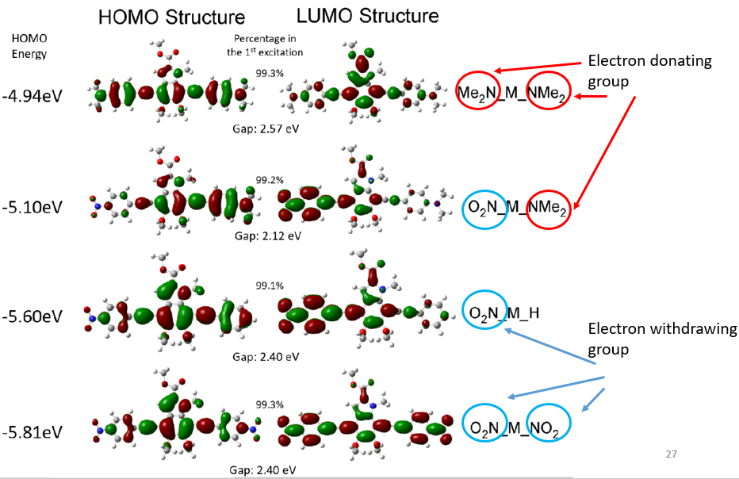
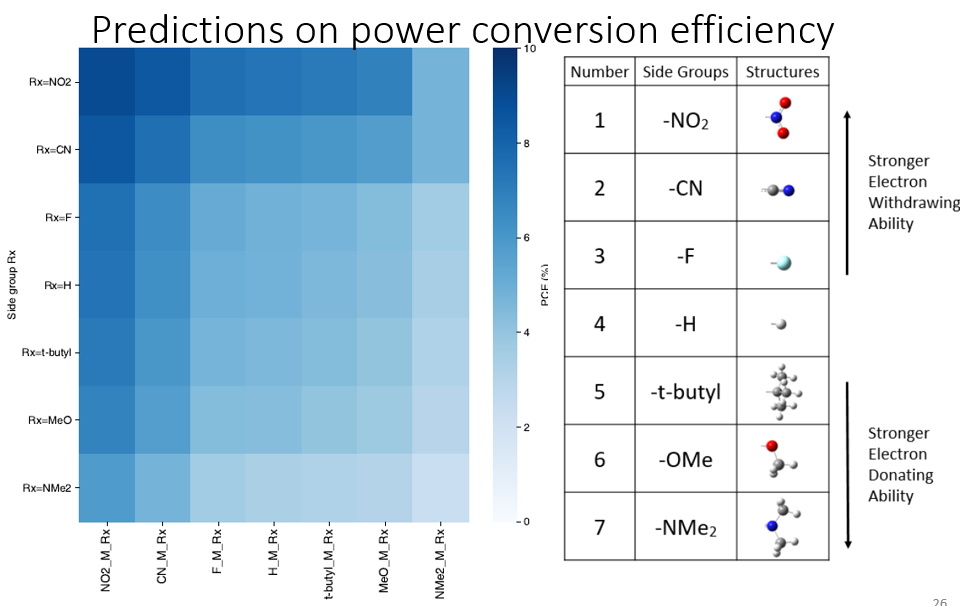
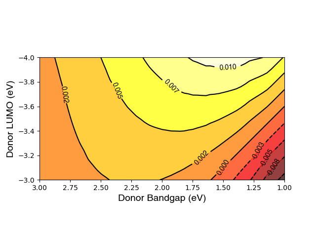

# Bio-inspired melanin design for organic photovoltaic
## Goals: 

**(phase1)** Explore the rules behind spectrum change after adding electron donating or withdrawing groups at both ends of a natural black pigment eumelanin; Use the rules to design novel organic photovoltaic molecules with a better solubility and power conversion efficiency.

**(phase2)** Further explore other combinations of spacer molecule, while keep the core still be eumelanin. Use the rules to design novel organic photovoltaic moleclues.

## Phase 1 Results:

Title: Designing novel organic photovoltaic molecules based on bio-inspired melanin

#### Adding EWGs (electron withdrawing groups) at both ends will change the HOMO (Highest occupied molecular orbitals): the stronger the EWGs the deeper the HOMO;

#### Adding groups of different properties (EWG or EDG) at each end will change the bandgap: the stronger the EWG and EDG, the narrower the bandgap;

  

#### The molecule backbone (framework) based on EndgroupX-benzene-eumelanin-benzene-EndgroupY has the maximum PCE around 9%.

  

## Scripts
**data extraction:**

  - <u>*p1\_extract\_homolumo\_singlefile.py*</u>: Extracting HOMO/LUMO calculation results from Gaussian09 output file;
  - <u>*p1\_extract\_homolumo\_folder\_difflevels.py*</u>: Extracting HOMO/LUMO calculation results from the folder containing many Gaussian09 files;
  - <u>*p1\_extract\_tdsinglet\_gap\_singlefile.py*</u>:  Extracting Bandgap calculation results from Gaussian09 output file;
  - <u>*p1\_extract\_tdsinglet\_gap\_folder\_difflevels.py*</u>: Extracting Bandgap calculation results from the folder containing many Gaussian09 files;

**data reading from files**

- <u>*read\_a\_cell\_in\_excel2013.py*</u>; read_data_from_excel2013.py: wrapper for "openpyxl" to read excel file;

**data calculation**

- *<u>4\_2mt\_cal\_abs.c, 4\_10mt\_cal\_abs.c</u>*: Bash script cannot be parallel executed; This program is using C to start multiple threads, and each thread run a bash script; therefore, the power of multi-cores CPU can be fully utilized.

**plot figures**
- *<u>heatmap\_of\_PCE.py</u>*: generate a heatmap of PCE values for all combinations of end groups.
- *<u>place\_PCE\_on\_scharberM\_exa1</u>*: plot the contour map of Scharber's Model (Theoretical model of organic photovoltaic) and place our result molecules on the map.

