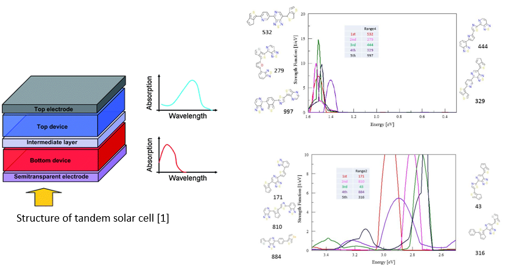

# Top1000_molecule_screening_for_tandem_solar_cells
## Goals:

**(Phase1):** Explore the correlations between solar spectrum coverage and the built pattern of top-1000 molecules in the CEPDB database (Harvard Clean Energy Project Database); Apply the correlation found to discover molecules for the tandem solar cell.

**(Phase2):** Using deep learning package DEEPCHEM to discover more molecule built pattern or spectrum shift rules beyond empirical photochemistry rules.

## Phase1 Results

Title: Computational assessment of organic photovoltaic candidate compounds

- Design a descriptor (Correlation ratio or CR) to describe the correlation between the solar spectrum and the molecule's absorption spectrum.
- Use the CR to screen out molecules that have strong absorptions in four different ranges of the solar spectrum (UV, Vis I, Vis II and IR) for application of tandem solar cell.
- Combinations for tandem solar cells: molecules absorb sunlight in different ranges, and they combined together can achieve total absorption of the solar spectrum.

**Scripts**
**data scraping**

- *<u>generateG09inputfromhtml.py</u>*: Scraping information of molecules from the website of the CEPDB database and generate Gaussian09 input file.

**data extraction**

- *<u>extract_G09_output_to_xyz.py</u>*: extract coordinate information of atoms from Gaussian09 results and converted into xyz input file format;
- *<u>2_generate_octopus_gs_input (bash shell script)</u>*: generate Octopus input file for ground state calculations and submit to HPCC job queue;
- *<u>3_generate_octopus_td_input_x(y/z) (bash shell script)</u>*: generate Octopus input file for time-dependent calculations;

**data calculation**

- *<u>4_2mt_cal_abs.c, 4_10mt_cal_abs.c</u>*: Bash script cannot be parallel executed; This program is using C to start multiple threads, and each thread run a bash script; therefore, the power of multi-cores CPU can be fully utilized.

**plot figures**
- *<u>plot_spectrum.py</u>*: plot absorption spectrum from an output of Octopus software.
- *<u>plot_octopus_td.py</u>*: plot absorption spectra from the folder that containing many outputs of Octopus software;

